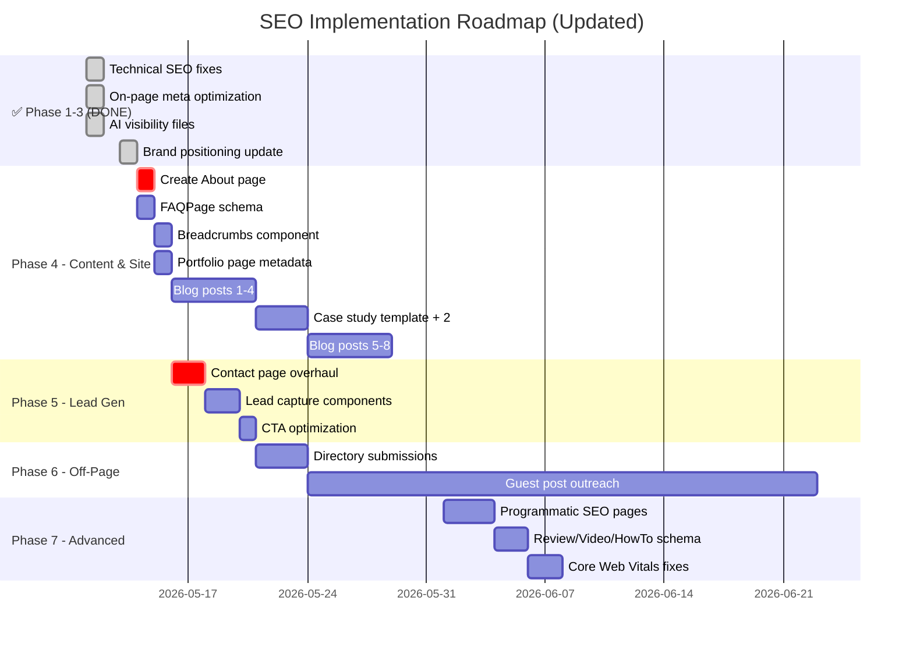

# UI Pirate — SEO, AI Visibility & Lead Generation Plan (v2)

> **Goal**: Dominate organic search for "product design & development agency" queries, get cited by AI assistants (ChatGPT, Perplexity, Gemini), and generate qualified leads from the US market.
> **Brand Position**: Product design & development agency — we turn ideas into shipped products. Not just pretty designs, but product thinking, competitive analysis, information architecture, UX/UI, and complex enterprise Angular/React frontend development.
> **Site**: [uipirate.com](https://uipirate.com) · Next.js 14 · Vercel

---

## Implementation Status

> **Last audited:** 2026-05-21 — synced with codebase.

| Phase | Status | Details |
|-------|:------:|---------|
| **Phase 1 — Technical SEO** | ✅ DONE | SSR fix, JSON-LD inlined, dynamic sitemap, `robots.txt` with AI crawlers |
| **Phase 2 — On-Page SEO** | ✅ DONE | Per-page metadata for all 9+ pages, dynamic `generateMetadata()` for services |
| **Phase 3 — AI Visibility** | ✅ DONE | `llms.txt`, `ai-plugin.json`, `ai-data.json`, `SiteNavigationElement` schema |
| **Brand Positioning Update** | ✅ DONE | "Product design & development partner" across SEO files |
| **Angular Focus** | ✅ DONE | Angular positioned as #1 technology in metadata and structured data |
| **Email Update** | ✅ DONE | `vishal@uipirate.com` (incl. `ai-plugin.json` — fixed May 2026) |
| **Google Search Console Fixes** | ✅ DONE | Fixed 5xx in `[slug]`, `/privacy-policy` → `/privacy` redirect |
| **Phase 4 — Site & Schema** | ✅ DONE | About, FAQPage schema, Breadcrumbs, portfolio metadata |
| **Phase 4 — Content** | 🟡 IN PROGRESS | Case study template + 2 live studies; blog calendar (16 posts) not started |
| **Phase 5 — Lead Generation** | 🟡 IN PROGRESS | Contact: Cal.com + `ProjectEstimate` (primary capture); footer modal optional; lead magnets & CTA copy pending |
| **Phase 6 — Off-Page SEO** | 🔴 NOT STARTED | Directory submissions, guest posts, backlink building |
| **Phase 7 — Advanced** | 🟡 PARTIAL | `AggregateRating` on testimonials; programmatic pages, HowTo/VideoObject, CWV pending |

---

## What Was Completed (Phases 1-3)

### Technical SEO ✅
- ✅ Removed `"use client"` + `ssr: false` from homepage — Google can now crawl all content
- ✅ Extracted `Lenis` smooth scroll to client-only `SmoothScroll.tsx` component
- ✅ Inlined `ProfessionalService` + `WebSite` + `SiteNavigationElement` JSON-LD schemas in `layout.tsx`
- ✅ Created dynamic `app/sitemap.ts` — auto-generates routes including blog posts from MongoDB
- ✅ Fixed `robots.txt` — removed `Crawl-delay`, added AI crawler permissions (GPTBot, Claude-Web, etc.)
- ✅ Fixed `[slug]/page.tsx` — was fetching from `https://api.example.com/` causing 5xx errors
- ✅ Fixed `/privacy-policy` → redirects to `/privacy` (resolved "Alternative page with canonical" issue)

### On-Page SEO ✅
- ✅ Unique metadata for: Homepage, Services, each Service Detail (7 services), Pricing, Blogs, FAQs, Contact, Case Studies, Privacy, Terms
- ✅ Dynamic `generateMetadata()` in `services/[id]/page.tsx` — per-service titles, descriptions, keywords
- ✅ `BlogPosting` JSON-LD schema added to `[slug]/page.tsx` for blog post rich results
- ✅ All pages have canonical URLs via `alternates.canonical`

### AI Visibility ✅
- ✅ Created `public/llms.txt` — entity-dense document for AI training (with full approach, services, clients)
- ✅ Created `public/.well-known/ai-plugin.json` — OpenAI plugin manifest
- ✅ Updated `public/ai-data.json` — full product partner positioning
- ✅ Updated `public/enterprise-schema.json` — Angular, product thinking, competitive analysis in knowsAbout
- ✅ Added `SiteNavigationElement` schema — tells Google which pages to show as sitelinks

### Brand Positioning ✅
All 10 SEO files now reflect:
- **"Product design & development agency"** (not "design agency")
- **"Idea to shipped product"** — product thinking, competitive analysis, information architecture
- **Complex enterprise Angular/React applications** as core capability
- **"Have a conversation about your product — we carry the rest"** as tagline

---

## Phase 4 — Content & Site Changes 📝
**Priority: HIGH · Effort: Ongoing · Impact: HIGH (compounds over time)**

### 4.1 Create About Page (HIGH PRIORITY)

#### [NEW] `app/about/page.tsx`
Currently `/about` doesn't exist as a page. This is critical for both Google and AI assistants.

**Content structure:**
- Hero: "We Turn Ideas Into Shipped Products"
- Our Approach section: The 6-step process (Listen → Think → Plan → Design → Build → Ship)
- What Makes Us Different: Not just designs — product thinking, competitive analysis, architecture
- Team section: Vishal Anand + team bios with photos
- Industries & Expertise: SaaS, Fintech, HealthTech, LegalTech, E-commerce, AI
- Technology Stack: Angular, React, Next.js, TypeScript, Framer, Webflow
- Client Logos: Ipsos, Xperiti, RevUp AI, Bird, ArthAlpha, etc.
- Social proof: 50+ products shipped, 5.0 rating, Fortune 500 trust signals
- CTA: Book a conversation about your product

**SEO metadata:**
```typescript
title: "About UI Pirate | Product Design & Development Agency — Our Story & Approach"
description: "We turn product ideas into shipped products. Learn about our approach — product thinking, competitive analysis, UX/UI design & complex enterprise Angular/React development. 50+ products shipped for Fortune 500 clients."
```

**Schema**: `AboutPage` type with team `Person` entities

---

### 4.2 Add FAQPage Schema to /faqs (RICH RESULTS)

#### [MODIFY] `app/faqs/page.tsx`
Add `FAQPage` JSON-LD schema using data from `data/faqs.json`. This enables Google FAQ rich results — the expandable Q&A snippets directly in search results.

```json
{
  "@context": "https://schema.org",
  "@type": "FAQPage",
  "mainEntity": [
    {
      "@type": "Question",
      "name": "What kinds of services does UiPirate offer?",
      "acceptedAnswer": {
        "@type": "Answer",
        "text": "We specialize in product design and development..."
      }
    }
  ]
}
```

**Impact**: FAQ-style rich results increase click-through rate by 30-50%.

---

### 4.3 Add Breadcrumbs with BreadcrumbList Schema

#### [NEW] `components/Breadcrumbs.tsx`
Add breadcrumb navigation to all inner pages with `BreadcrumbList` schema markup.

```
Home > Services > SaaS Web & Mobile Apps
Home > Blog > [Post Title]
Home > Case Studies
```

**Pages to add breadcrumbs**: Services, Service Details, Blog Posts, Case Studies, Pricing, FAQs, Contact, Privacy, Terms

---

### 4.4 Portfolio Page Metadata

#### [MODIFY] `app/ourWorks/page.tsx`
Currently has NO metadata at all. Add:

```typescript
title: "Our Work | 50+ Product Design & Development Projects | UI Pirate"
description: "Explore our portfolio of 50+ shipped products — SaaS platforms, enterprise dashboards, AI applications, mobile apps & design systems. Built with Angular, React & Next.js for clients like Ipsos, Xperiti, and RevUp AI."
```

---

### 4.5 Blog Content Calendar (US-Focused, Product Thinking Angle)

> [!IMPORTANT]
> Blog content should reflect the new brand positioning — not generic "design tips" but deep product thinking, competitive analysis frameworks, and enterprise development insights.

#### Month 1-2: Foundation Content (8 posts)
| # | Title | Target Keyword | Type |
|:-:|-------|---------------|------|
| 1 | "From Idea to Product: A Step-by-Step Guide for Non-Technical Founders" | idea to product | Pillar |
| 2 | "How to Choose a Product Design & Development Agency (Buyer's Guide)" | hire product design agency | Commercial |
| 3 | "Case Study: Building Xperiti's Enterprise Research Platform from Scratch" | enterprise saas design case study | Case Study |
| 4 | "Product Thinking vs Feature Factories: Why Most SaaS Products Fail" | product thinking for saas | Thought Leadership |
| 5 | "UI/UX Design + Development Cost in 2026: Complete Pricing Guide" | ui ux design cost | Commercial |
| 6 | "Case Study: AI-Powered LegalTech for APAC's Largest Law Firm" | ai app design case study | Case Study |
| 7 | "SaaS Dashboard Design: 12 Best Practices for Complex Enterprise Apps" | saas dashboard design | Pillar |
| 8 | "Angular vs React for Enterprise Applications: A Decision Framework" | angular vs react enterprise | Tutorial |

#### Month 3-4: Authority Content (8 posts)
| # | Title | Target Keyword | Type |
|:-:|-------|---------------|------|
| 9 | "Information Architecture for Complex SaaS Products" | information architecture saas | Pillar |
| 10 | "Competitive Analysis for Product Design: Finding Your Edge" | competitive analysis product design | Tutorial |
| 11 | "Case Study: Brahmastra Fintech Trading Platform" | fintech dashboard design | Case Study |
| 12 | "Free UX Audit Checklist: Template Inside" | ux audit checklist | Lead Magnet |
| 13 | "Building Enterprise Angular Applications: Architecture Patterns" | enterprise angular development | Tutorial |
| 14 | "Design Agency vs Product Studio: What's Right for Your SaaS?" | design agency vs product studio | Commercial |
| 15 | "Case Study: RevUp AI — From MVP Idea to Enterprise Platform" | saas mvp design | Case Study |
| 16 | "Design Systems for Angular & React Teams: A Practical Guide" | angular react design system | Tutorial |

---

### 4.6 Case Studies Section

#### [NEW] `app/case-studies/[slug]/page.tsx`
Create detailed case study template with:
- **Problem → Approach → Solution → Results** structure
- Before/after screenshots
- Product thinking breakdown (how we analyzed competitive landscape, defined IA)
- Client testimonial embed
- Metrics (engagement increase, conversion improvement)
- Technologies used (Angular, React, etc.)
- Related services CTA
- `CaseStudy` schema markup

#### Priority Case Studies:
1. **Xperiti** — Enterprise SaaS research platform (USA)
2. **RevUp AI** — AI SaaS platform from MVP (USA)
3. **Bird** — Brand & product design (USA)
4. **Brahmastra** — Fintech trading platform (India)
5. **APAC Law Firm** — AI-powered LegalTech (India)
6. **ION** — Medical supply chain SaaS

---

## Phase 5 — Lead Generation Funnel 💰
**Priority: HIGH · Effort: 3-4 days · Impact: HIGH**

> [!IMPORTANT]
> Currently the only conversion path is a Cal.com iframe on `/contact`. You need multiple lead capture mechanisms for different stages of the buyer journey.

### 5.1 Contact Page Overhaul

#### [MODIFY] `app/contact/page.tsx`
Replace bare iframe with a conversion-optimized page:

- **Hero**: "Have a Conversation About Your Product — We Carry the Rest"
- **Quick contact form**: Name, Email, Company, Project Type (dropdown), Budget Range, "Tell us about your idea" (textarea)
- **Cal.com embed**: For those ready to book directly
- **Social proof strip**: Client logos + "50+ products shipped" + "5.0 rating"
- **Trust signals**: "Typical response time: 2 hours" · "Free 15-min consultation" · "No obligation"
- **Process preview**: "Here's what happens after you reach out" (3-step visual)
- Add `ContactPage` schema

### 5.2 Lead Magnets (Gated Content)

| Lead Magnet | Target Audience | Placement |
|-------------|----------------|-----------|
| **Free Product Thinking Checklist** (PDF) | Non-technical founders | Blog sidebar, `/services` CTA |
| **Idea to Product Playbook** (10-page guide) | SaaS founders, product managers | Homepage popup, blog posts |
| **Design System Starter Kit** (Figma) | Dev teams | `/services/Design-System` page |
| **Competitive Analysis Template** (Notion) | Product managers | Blog posts about competitive analysis |

#### Implementation:
- [NEW] `components/LeadCaptureForm.tsx` — Email capture with name, email, company
- [NEW] `app/api/leads/route.ts` — Store leads in MongoDB
- [NEW] `components/ExitIntentPopup.tsx` — Show lead magnet on exit intent
- Add email field + CTA to blog post footer

### 5.3 CTA Optimization

| Page | Current CTA | Optimized CTA |
|------|------------|---------------|
| Homepage | Generic "Contact" | "Tell Us Your Idea — Free Consultation" |
| Services | None specific | "Start Your Product Journey — Book a 15-Min Call" |
| Blog posts | None | "Struggling with [topic]? Let's talk about your product" |
| Pricing | Cal.com link | "Compare Plans" + "Book a Call" + "Download Pricing PDF" |
| Case Studies | None | "Want Similar Results? Share Your Product Idea" |
| Portfolio | None | "Let's Build Something Like This For You" |

### 5.4 US-Specific Trust Signals
- Add US client logos prominently (Xperiti NY, Awesome Health Club CA, Bird SF, RevUp AI TX)
- Add "Serving clients across the United States" messaging
- Display US timezone availability
- Add Clutch badge/rating widget
- Consider a US virtual business address for Google Business Profile

---

## Phase 6 — Off-Page SEO & Backlinks 🔗
**Priority: MEDIUM · Effort: Ongoing · Impact: HIGH (slow build)**

### 6.1 Quick Wins (Week 1-2)
- [ ] Submit to **Awwwards**, **CSS Design Awards**, **SiteInspire**
- [ ] Complete **Crunchbase** and **G2** profiles
- [ ] Create **Product Hunt** launch for Mini SaaS Apps / Apps4Sale
- [ ] Request backlinks from 3 US clients (Xperiti, RevUp AI, Bird)
- [ ] Submit site to **ProductHunt**, **BetaList**, **IndieHackers**

### 6.2 Monthly Ongoing
- [ ] 2 guest posts/month on Smashing Magazine, UX Collective, CSS-Tricks
- [ ] 4 Medium articles/month (republish blogs with canonical)
- [ ] Weekly Reddit engagement in r/SaaS, r/userexperience, r/web_design, r/angular
- [ ] Weekly LinkedIn articles + product design carousel posts
- [ ] Monthly Behance/Dribbble project uploads
- [ ] Angular community engagement — contribute to angular.dev, write Angular tutorials

### 6.3 Digital PR
- [ ] "From Idea to Product: The 2026 Product Design Report" (linkable asset)
- [ ] Free Figma UI kit for SaaS dashboards (drives backlinks from design resource sites)
- [ ] Podcast appearances on design/startup/Angular podcasts
- [ ] Angular conference talks or workshop proposals

---

## Phase 7 — Advanced Site Improvements 🚀
**Priority: MEDIUM · Effort: 1-2 weeks · Impact: MEDIUM-HIGH**

### 7.1 Programmatic SEO Pages

#### [NEW] Location + Service combo pages
Create pages targeting high-intent US local searches:
- `/services/product-design-agency-new-york`
- `/services/angular-development-agency-san-francisco`
- `/services/saas-design-agency-austin-texas`
- `/services/ui-ux-design-agency-usa`
- `/services/enterprise-angular-development`

Each page has unique content about serving that specific market.

### 7.2 Review & Testimonial Schema

#### [MODIFY] Homepage testimonials section
Add `Review` schema with `aggregateRating` to get star ratings in Google search results:

```json
{
  "@type": "AggregateRating",
  "ratingValue": "5.0",
  "reviewCount": "50",
  "bestRating": "5"
}
```

### 7.3 Video Schema for Motion Graphics

#### [MODIFY] Motion graphics service page
Add `VideoObject` schema for showreel/portfolio videos to appear in Google Video results.

### 7.4 HowTo Schema for Process Pages

#### [MODIFY] Service detail pages
Add `HowTo` schema to the process/methodology sections — triggers step-by-step rich results:

```
Step 1: Share your product vision
Step 2: We do competitive analysis & product thinking
Step 3: Information architecture & user flows
Step 4: UX/UI design & prototyping
Step 5: Frontend development in Angular/React
Step 6: Launch, iterate & scale
```

### 7.5 Core Web Vitals Optimization

| Issue | Fix |
|-------|-----|
| Banner video in `/public` | Move to Cloudinary with adaptive streaming, lazy-load below fold |
| No `loading="lazy"` on below-fold images | Add to all non-LCP images |
| Font optimization | Subset fonts, use `font-display: swap`, preload critical fonts |
| JavaScript bundle size | Analyze with `@next/bundle-analyzer`, tree-shake unused dependencies |

---

## Implementation Priority & Timeline



---

## Expected Results (6-Month Forecast)

| Metric | Current (Est.) | 3 Months | 6 Months |
|--------|:-:|:-:|:-:|
| Organic Traffic (US) | ~100/mo | ~800/mo | ~3,000/mo |
| Google Indexed Pages | ~20 | ~50 | ~100+ |
| AI Citations (ChatGPT/Perplexity) | Rare | Regular | Frequent |
| Leads/month from organic | ~2-3 | ~15-20 | ~30-50 |
| Domain Authority | ~15 | ~28 | ~40 |
| Blog Posts Published | ~5 | ~20 | ~40 |
| Backlinks (referring domains) | ~30 | ~100 | ~200+ |

---

## Next Steps (What to Do Now)

> [!IMPORTANT]
> **Immediate actions (this week):**
> 1. ⏳ Deploy latest changes to production (robots.txt, case studies, exit intent, contact form)
> 2. ⏳ Submit sitemap in Google Search Console: `https://uipirate.com/sitemap.xml`
> 3. ⏳ Request re-indexing for `/about`, `/case-studies/xperiti`, `/case-studies/revup-ai`, `/contact`
> 4. ⏳ Publish blog posts 1–4 from content calendar
> 5. ⏳ Add 4 more case studies (Bird, Brahmastra, APAC Law Firm, ION) to `data/case-studies.json`

---

## Files Modified/Created Summary

| Action | File | Phase | Status |
|--------|------|:-----:|:------:|
| **MODIFY** | `app/page.tsx` — SSR fix + product partner metadata | 1+2 | ✅ |
| **NEW** | `components/SmoothScroll.tsx` — Client-only Lenis wrapper | 1 | ✅ |
| **MODIFY** | `app/layout.tsx` — Inline JSON-LD, product partner descriptions, SiteNavigationElement | 1+3 | ✅ |
| **NEW** | `app/sitemap.ts` — Dynamic sitemap generation | 1 | ✅ |
| **MODIFY** | `public/robots.txt` — AI crawler permissions | 1+3 | ✅ |
| **MODIFY** | `app/services/page.tsx` — Product partner metadata | 2 | ✅ |
| **MODIFY** | `app/services/[id]/page.tsx` — Dynamic meta per service + JSON-LD | 2 | ✅ |
| **MODIFY** | `app/pricing/page.tsx` — Commercial-intent meta | 2 | ✅ |
| **MODIFY** | `app/blogs/page.tsx` — Blog listing meta | 2 | ✅ |
| **MODIFY** | `app/faqs/page.tsx` — FAQ page meta | 2 | ✅ |
| **MODIFY** | `app/contact/page.tsx` — Contact page meta | 2 | ✅ |
| **MODIFY** | `app/case-studies/page.tsx` — Case studies meta | 2 | ✅ |
| **NEW** | `public/llms.txt` — AI discovery file (product partner) | 3 | ✅ |
| **NEW** | `public/.well-known/ai-plugin.json` — AI plugin manifest | 3 | ✅ |
| **MODIFY** | `public/ai-data.json` — Product partner structured data | 3 | ✅ |
| **MODIFY** | `public/enterprise-schema.json` — Product partner schema | 3 | ✅ |
| **MODIFY** | `components/seo.tsx` — Product partner schema component | 3 | ✅ |
| **MODIFY** | `app/[slug]/page.tsx` — Fixed 5xx error, added BlogPosting schema | Fix | ✅ |
| **MODIFY** | `app/privacy-policy/page.tsx` — Redirect to /privacy | Fix | ✅ |
| **NEW** | `app/about/page.tsx` — Rich about page | 4 | ✅ |
| **MODIFY** | `app/faqs/page.tsx` — Add FAQPage schema | 4 | ✅ |
| **NEW** | `components/Breadcrumbs.tsx` — Breadcrumb navigation | 4 | ✅ |
| **MODIFY** | `app/ourWorks/page.tsx` — Portfolio metadata | 4 | ✅ |
| **NEW** | `data/case-studies.json` + `app/case-studies/[slug]/page.tsx` | 4 | ✅ (2 studies; expand to 6) |
| **MODIFY** | `app/contact/ContactPageClient.tsx` — Cal.com + ProjectEstimate only | 5 | ✅ |
| **NEW** | `components/LeadCaptureForm.tsx` — Email capture | 5 | ✅ |
| **NEW** | `app/api/leads/route.ts` — Lead storage API | 5 | ✅ |
| **NEW** | `components/ExitIntentPopup.tsx` — Exit intent lead capture | 5 | ❌ Removed (duplicate of estimator) |
| **MODIFY** | `public/robots.txt` — AI crawler allow rules | 1+3 | ✅ (restored May 2026) |
| **MODIFY** | `public/.well-known/ai-plugin.json` — Contact email fix | 3 | ✅ |
