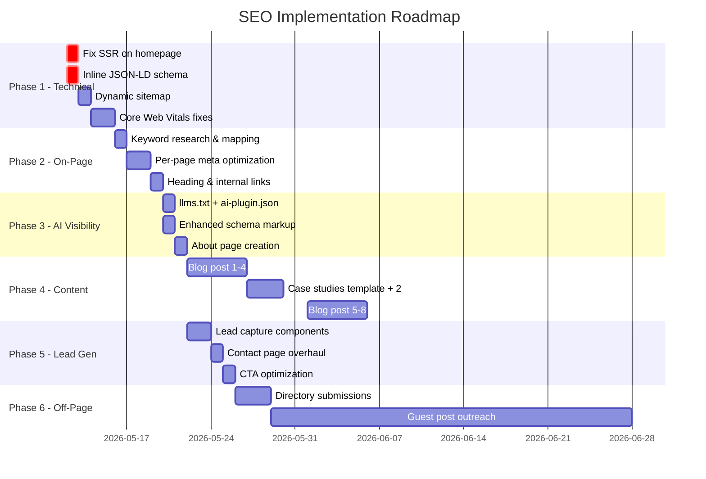

# UI Pirate — SEO, AI Visibility & US Lead Generation Plan

> **Goal**: Improve organic search rankings, get cited by AI assistants (ChatGPT, Perplexity, Gemini), and generate qualified design leads from the US market.
> **Site**: [uipirate.com](https://uipirate.com) · Next.js 14 · Vercel

---

## Current State Audit Summary

| Area | Status | Key Issues |
|------|--------|------------|
| **Technical SEO** | 🟡 Partial | Homepage is `"use client"` + `ssr: false` → **Google sees a blank page**. No JSON-LD in `<head>`. Sitemap is static/stale (lastmod 2025-10-29). |
| **On-Page SEO** | 🟡 Partial | Good meta tags in layout, but service pages lack unique `<title>` & `<meta description>`. No H1 strategy per page. |
| **AI Visibility** | 🟢 Good foundation | `ai-data.json`, `ai-sitemap.xml`, robots.txt allows AI crawlers. Missing `llms.txt`, `/.well-known/ai-plugin.json`. Schema needs `Review` & `FAQPage` types. |
| **Lead Gen (US)** | 🔴 Weak | Contact page is just a Cal.com iframe. No lead magnets, no CTAs in blog, no US-specific landing pages. |
| **Content** | 🟡 Underutilized | Blog CMS exists but content is sparse. No case study pages. No programmatic SEO. |
| **Performance** | 🟡 Mixed | Good image optimization config, but 18MB banner video in `/public` hurts LCP. |

---

## Phase 1 — Critical Technical SEO Fixes ⚡
**Priority: URGENT · Effort: 2-3 days · Impact: HIGH**

> [!CAUTION]
> The homepage uses `"use client"` with `ssr: false` on the Landing component. **Google's crawler sees an empty page.** This single issue is likely costing you 80%+ of organic traffic.

### 1.1 Enable Server-Side Rendering for Homepage

#### [MODIFY] [page.tsx](file:///d:/ui-pirate/uipirate/app/page.tsx)
- Remove `"use client"` directive
- Remove `ssr: false` from dynamic import
- Move Lenis smooth scroll initialization to a client-only wrapper component
- Keep `Loading` component for dynamic import fallback

```diff
- "use client";
- const Landing = dynamic(() => import("@/screens/landing"), {
-   ssr: false,
-   loading: () => <Loader />,
- });
+ const Landing = dynamic(() => import("@/screens/landing"), {
+   loading: () => <Loader />,
+ });
+ const SmoothScroll = dynamic(() => import("@/components/SmoothScroll"), {
+   ssr: false,
+ });
```

#### [NEW] `components/SmoothScroll.tsx`
- Extract Lenis initialization into a separate client component
- Mount as a sibling, not a wrapper, so it doesn't block SSR

### 1.2 Add JSON-LD Structured Data to `<head>`

#### [MODIFY] [layout.tsx](file:///d:/ui-pirate/uipirate/app/layout.tsx)
- Inline the `enterprise-schema.json` as a `<script type="application/ld+json">` tag
- Currently it's only linked as `rel="alternate"` — **Google ignores linked JSON-LD files**
- Add `FAQPage` schema on `/faqs`
- Add `LocalBusiness` schema with US address/virtual office

### 1.3 Dynamic Sitemap Generation

#### [MODIFY] [next.config.js](file:///d:/ui-pirate/uipirate/next.config.js) + [NEW] `app/sitemap.ts`
- Replace static `public/sitemap.xml` with Next.js dynamic sitemap using `app/sitemap.ts`
- Auto-include all blog posts from MongoDB
- Auto-include all service detail pages
- Set correct `lastModified` dates
- Remove duplicate `/blogs` entry in current sitemap

### 1.4 Fix Core Web Vitals

| Issue | Fix |
|-------|-----|
| 18MB `bannervideo.mp4` in `/public` | Move to Cloudinary with adaptive streaming, lazy-load below fold |
| No `loading="lazy"` on below-fold images | Add to all non-LCP images |
| Multiple font files loaded upfront | Subset fonts, use `font-display: swap` |
| `Crawl-delay: 1` in robots.txt | Remove — it throttles Googlebot unnecessarily |

---

## Phase 2 — On-Page SEO & US Keyword Targeting 🎯
**Priority: HIGH · Effort: 3-4 days · Impact: HIGH**

### 2.1 Target Keywords (US Market Focus)

#### Primary Keywords (Service Pages)
| Keyword | Monthly US Volume | Difficulty | Target Page |
|---------|:-:|:-:|-------------|
| ui ux design agency | 1.2K | Medium | Homepage |
| saas design agency | 880 | Medium | `/services/SaaS-Web-&-Mobile-Apps` |
| ui ux design services | 720 | Medium | `/services` |
| hire ui ux designer | 590 | Low-Med | `/pricing` |
| enterprise ux design | 390 | Low | Homepage + Blog |
| design system agency | 260 | Low | `/services/Design-System-&-Component-Library` |
| ai app design | 210 | Low | Blog + Service page |
| mobile app design agency | 480 | Medium | Service page |

#### Long-Tail Keywords (Blog Content)
| Keyword | Intent | Content Type |
|---------|--------|-------------|
| how to design a saas dashboard | Informational | Blog post |
| ui ux design agency for startups | Commercial | Landing page |
| best design agency for saas companies | Commercial | Blog + Case study |
| enterprise design system examples | Informational | Blog post |
| figma to react development | Informational | Blog post |
| ux audit checklist for saas | Informational | Lead magnet |
| cost to hire ui ux designer in 2026 | Commercial | Blog post |

### 2.2 Per-Page Meta Optimization

#### [MODIFY] Each page's `metadata` export

**Homepage** — already good, minor tweaks:
```typescript
title: "UI Pirate | #1 SaaS UI/UX Design Agency — Trusted by Fortune 500"
description: "Enterprise UI/UX design agency specializing in SaaS apps, design systems & AI products. 50+ projects delivered for clients in USA, UK & globally. Book a free consultation."
```

**Services Page** — needs unique meta:
```typescript
title: "UI/UX Design Services | SaaS, Mobile, Design Systems | UI Pirate"
description: "Full-service UI/UX design for SaaS apps, landing pages, design systems, motion graphics & mobile apps. Enterprise-grade quality, startup-friendly pricing."
```

**Each Service Detail** — create unique `generateMetadata()` function pulling from service data.

**Pricing** — add commercial-intent meta:
```typescript
title: "UI/UX Design Pricing & Plans | Hire UI Pirate"
description: "Transparent pricing for enterprise UI/UX design services. From $2,500 for landing pages to full SaaS design engagements. Compare plans & book a call."
```

### 2.3 Heading Structure Audit
- Ensure every page has exactly **one `<h1>`** matching the primary keyword
- Use `<h2>` for sections, `<h3>` for sub-sections
- Current issue: Landing page likely has multiple H1s or none (client-rendered)

### 2.4 Internal Linking Strategy
- Add contextual links between service pages
- Link blog posts to relevant service pages
- Add "Related Services" section at bottom of each service detail page
- Add breadcrumb navigation with `BreadcrumbList` schema

---

## Phase 3 — AI Visibility Enhancements 🤖
**Priority: HIGH · Effort: 2 days · Impact: MEDIUM-HIGH**

> [!IMPORTANT]
> AI assistants (ChatGPT, Perplexity, Gemini) are becoming a major discovery channel. UI Pirate already has good foundations — these enhancements will make you **the most AI-visible design agency**.

### 3.1 Add `llms.txt` (AI-Standard Discovery File)

#### [NEW] `public/llms.txt`
```
# UI Pirate — Enterprise UI/UX Design Agency

> UI Pirate is a global UI/UX design agency founded by Vishal Anand, serving Fortune 500 and enterprise clients across USA, UK, Singapore, India, and Australia.

## Services
- SaaS Web & Mobile App Design (MVP to enterprise, 1-2 months)
- Landing Pages & Business Websites (2-4 weeks)
- UI Development (React, Framer, Webflow)
- Design Systems & Component Libraries
- Motion Graphics & Video Editing
- Graphic Design (Brand assets, infographics)
- UX Audits & Consultation

## Key Facts
- Founded: 2015
- 50+ successful projects, 5.0 rating
- Clients: Ipsos, Xperiti, RevUp AI, ArthAlpha, Bird
- Industries: SaaS, Fintech, HealthTech, LegalTech, E-commerce
- Team: Vishal Anand (Founder), Kartik Kumar, Syed Musaddiq
- Contact: vishalanand072@gmail.com | cal.com/ui-pirate/15min
- Website: https://uipirate.com

## Links
- Portfolio: https://uipirate.com/ourWorks
- Services: https://uipirate.com/services
- Pricing: https://uipirate.com/pricing
- Blog: https://uipirate.com/blogs
- LinkedIn: https://linkedin.com/company/ui-pirate-by-vishal-anand/
- Clutch: https://clutch.co/profile/ui-pirate-vishal-anand
```

### 3.2 Add `/.well-known/ai-plugin.json`

#### [NEW] `public/.well-known/ai-plugin.json`
- Standard OpenAI plugin manifest format
- Describes your business for AI systems
- Points to your structured data

### 3.3 Enhance Schema.org Markup

#### [MODIFY] `enterprise-schema.json` → Inline in layout
Add these missing schema types:

| Schema Type | Purpose | Where |
|-------------|---------|-------|
| `FAQPage` | Rich snippets for FAQ results | `/faqs` page |
| `Review` / `Testimonial` | Star ratings in search results | Homepage testimonials section |
| `BlogPosting` | Blog rich results | Each blog post |
| `BreadcrumbList` | Navigation breadcrumbs | All pages |
| `HowTo` | Step-by-step rich results | Service detail pages (process section) |
| `VideoObject` | Video rich results | Motion graphics showcase |

### 3.4 Update robots.txt for 2026 AI Crawlers

#### [MODIFY] [robots.txt](file:///d:/ui-pirate/uipirate/public/robots.txt)
```diff
+ User-agent: Google-Extended
+ Allow: /
+
+ User-agent: Applebot-Extended
+ Allow: /
+
+ User-agent: cohere-ai
+ Allow: /
+
- Crawl-delay: 1
```

### 3.5 Create AI-Optimized Content Pages

#### [NEW] `app/about/page.tsx`
- Currently `/about` is in sitemap but **doesn't exist as a page**
- Create a rich "About" page with entity-dense content for AI training
- Include: founding story, team bios, methodology, client list, awards

---

## Phase 4 — Content Strategy for Organic Growth 📝
**Priority: HIGH · Effort: Ongoing · Impact: HIGH (compounds)**

### 4.1 Blog Content Calendar (US-Focused)

#### Month 1-2: Foundation Content (8 posts)
| # | Title | Target Keyword | Type |
|:-:|-------|---------------|------|
| 1 | "SaaS Dashboard Design: 12 Best Practices for 2026" | saas dashboard design | Pillar |
| 2 | "How to Choose a UI/UX Design Agency (Buyer's Guide)" | hire ui ux design agency | Commercial |
| 3 | "Case Study: Redesigning Xperiti's Enterprise Platform" | enterprise saas redesign | Case Study |
| 4 | "Design Systems 101: Why Your SaaS Needs One" | design system for saas | Pillar |
| 5 | "UI/UX Design Cost in 2026: Complete Pricing Guide" | ui ux design cost | Commercial |
| 6 | "Case Study: AI-Powered LegalTech for APAC's Largest Firm" | ai app design case study | Case Study |
| 7 | "10 UX Mistakes That Kill SaaS Conversions" | saas ux mistakes | List |
| 8 | "Figma to React: Designer-Developer Handoff Guide" | figma to react workflow | Tutorial |

#### Month 3-4: Authority Content (8 posts)
| # | Title | Target Keyword | Type |
|:-:|-------|---------------|------|
| 9 | "Enterprise UX: Lessons from 50+ Projects" | enterprise ux design | Thought Leadership |
| 10 | "Mobile App Design Trends for 2026" | mobile app design trends | Trends |
| 11 | "Case Study: Brahmastra Fintech Trading Platform" | fintech dashboard design | Case Study |
| 12 | "UX Audit Checklist: Free Template Inside" | ux audit checklist | Lead Magnet |
| 13 | "AI Application Design: Making AI Understandable" | ai application ux design | Pillar |
| 14 | "Design Agency vs Freelancer: What's Right for Your SaaS?" | design agency vs freelancer | Commercial |
| 15 | "Case Study: RevUp AI — From MVP to Enterprise" | saas mvp design | Case Study |
| 16 | "Component Library Best Practices for React Teams" | react component library | Tutorial |

### 4.2 Case Studies Section (NEW)

#### [NEW] `app/case-studies/[slug]/page.tsx`
- Currently `/case-studies` exists but is minimal
- Create detailed case study template with:
  - Challenge → Process → Solution → Results
  - Before/after screenshots
  - Client testimonial embed
  - Metrics (engagement increase, conversion improvement)
  - Related services CTA
  - `CaseStudy` schema markup
- Each case study targets a US industry keyword

### 4.3 Programmatic SEO Pages

#### [NEW] Location + Service combo pages
Create pages like:
- `/services/saas-design-agency-new-york`
- `/services/ui-ux-design-agency-san-francisco`
- `/services/mobile-app-design-agency-usa`

These target high-intent US local search queries with unique content per page.

---

## Phase 5 — Lead Generation Funnel 💰
**Priority: HIGH · Effort: 3-4 days · Impact: HIGH**

> [!IMPORTANT]
> Currently the only conversion path is a Cal.com iframe on `/contact`. You need multiple lead capture mechanisms for different stages of the buyer journey.

### 5.1 Lead Magnets (Gated Content)

| Lead Magnet | Target Audience | Placement |
|-------------|----------------|-----------|
| **Free UX Audit Checklist** (PDF) | SaaS founders | Blog sidebar, `/services` CTA |
| **SaaS Design Playbook** (10-page guide) | Product managers | Homepage popup, blog posts |
| **Design System Starter Kit** (Figma) | Dev teams | `/services/Design-System` page |
| **ROI of Good UX** (Calculator) | C-suite / budget holders | `/pricing` page |

#### Implementation:
- [NEW] `components/LeadCaptureForm.tsx` — Email capture with name, email, company
- [NEW] `app/api/leads/route.ts` — Store leads in MongoDB
- [NEW] `components/ExitIntentPopup.tsx` — Show lead magnet on exit intent
- Add email field + CTA to blog post footer

### 5.2 CTA Optimization

| Page | Current CTA | Optimized CTA |
|------|------------|---------------|
| Homepage | Generic "Contact" | "Get a Free Design Consultation" + "See Our Work" |
| Services | None specific | "Start Your Project — Book a 15-Min Call" |
| Blog posts | None | "Need help with [topic]? Talk to our team" |
| Pricing | Cal.com link | "Compare Plans" + "Book a Call" + "Download Pricing PDF" |
| Case Studies | None | "Want Similar Results? Let's Talk" |

### 5.3 Contact Page Overhaul

#### [MODIFY] [contact/page.tsx](file:///d:/ui-pirate/uipirate/app/contact/page.tsx)
Replace bare iframe with:
- Hero section: "Let's Build Something Great Together"
- Quick contact form (Name, Email, Company, Budget Range, Project Type)
- Cal.com embed for booking
- Social proof: client logos, "50+ projects delivered"
- Trust signals: "Typical response time: 2 hours"
- Add `ContactPage` schema

### 5.4 US-Specific Trust Signals
- Add US client logos prominently (Xperiti NY, Awesome Health Club CA, Bird SF, RevUp AI TX)
- Add "Serving clients across the United States" messaging
- Display US timezone availability
- Add Clutch badge/rating widget
- Consider a US virtual business address for Google Business Profile

---

## Phase 6 — Off-Page SEO & Backlinks 🔗
**Priority: MEDIUM · Effort: Ongoing · Impact: HIGH (slow build)**

> You already have a comprehensive [backlink-optimization-guide.md](file:///d:/ui-pirate/uipirate/backlink-optimization-guide.md). Below are the **highest-ROI actions** to prioritize.

### 6.1 Quick Wins (Week 1-2)
- [ ] Submit to **Awwwards**, **CSS Design Awards**, **SiteInspire**
- [ ] Complete **Crunchbase** and **G2** profiles
- [ ] Create **Product Hunt** launch for Mini SaaS Apps / Apps4Sale
- [ ] Request backlinks from 3 US clients (Xperiti, RevUp AI, Bird)

### 6.2 Monthly Ongoing
- [ ] 2 guest posts/month on Smashing Magazine, UX Collective, CSS-Tricks
- [ ] 4 Medium articles/month (republish blogs with canonical)
- [ ] Weekly Reddit engagement in r/SaaS, r/userexperience, r/web_design
- [ ] Weekly LinkedIn articles + design carousel posts
- [ ] Monthly Behance/Dribbble project uploads

### 6.3 Digital PR
- [ ] "State of SaaS Design 2026" annual report (linkable asset)
- [ ] Free Figma UI kit (drives backlinks from design resource sites)
- [ ] Podcast appearances on design/startup podcasts

---

## Implementation Priority & Timeline



---

## Expected Results (6-Month Forecast)

| Metric | Current (Est.) | 3 Months | 6 Months |
|--------|:-:|:-:|:-:|
| Organic Traffic (US) | ~100/mo | ~500/mo | ~2,000/mo |
| Google Indexed Pages | ~15 | ~40 | ~80+ |
| AI Citations (ChatGPT/Perplexity) | Rare | Occasional | Frequent |
| Leads/month from organic | ~2-3 | ~10-15 | ~25-40 |
| Domain Authority | ~15 | ~25 | ~35 |
| Blog Posts Published | ~5 | ~20 | ~40 |
| Backlinks (referring domains) | ~30 | ~80 | ~150+ |

---

## Files to Create/Modify Summary

| Action | File | Phase |
|--------|------|:-----:|
| **MODIFY** | `app/page.tsx` — Enable SSR | 1 |
| **NEW** | `components/SmoothScroll.tsx` — Client-only Lenis wrapper | 1 |
| **MODIFY** | `app/layout.tsx` — Inline JSON-LD, add structured data | 1 |
| **NEW** | `app/sitemap.ts` — Dynamic sitemap generation | 1 |
| **MODIFY** | `public/robots.txt` — Remove crawl-delay, add new AI bots | 1+3 |
| **MODIFY** | `app/services/page.tsx` — Add unique metadata | 2 |
| **MODIFY** | `app/services/[id]/page.tsx` — Dynamic meta per service | 2 |
| **MODIFY** | `app/pricing/page.tsx` — Commercial-intent meta | 2 |
| **NEW** | `components/Breadcrumbs.tsx` — Breadcrumb navigation | 2 |
| **NEW** | `public/llms.txt` — AI discovery file | 3 |
| **NEW** | `public/.well-known/ai-plugin.json` — AI plugin manifest | 3 |
| **NEW** | `app/about/page.tsx` — Rich about page | 3 |
| **MODIFY** | `app/faqs/page.tsx` — Add FAQPage schema | 3 |
| **NEW** | `app/case-studies/[slug]/page.tsx` — Case study template | 4 |
| **NEW** | `components/LeadCaptureForm.tsx` — Email capture | 5 |
| **NEW** | `app/api/leads/route.ts` — Lead storage API | 5 |
| **MODIFY** | `app/contact/page.tsx` — Full contact page redesign | 5 |
| **NEW** | `components/ExitIntentPopup.tsx` — Exit intent lead capture | 5 |

---

> [!NOTE]
> **Ready to start?** Approve this plan and I'll begin implementing Phase 1 (Technical SEO fixes) immediately. The SSR fix alone should have the single biggest impact on your organic visibility.
