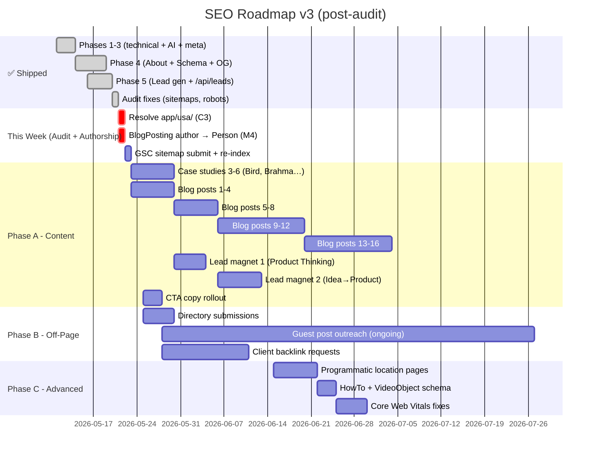

# UI Pirate — SEO, AI Visibility & Lead Generation Plan (v3)

> **Goal**: Dominate organic search for "product design & development agency" queries, get cited by AI assistants (ChatGPT, Perplexity, Gemini), and generate qualified US leads.
> **Brand Position**: Product design & development agency — we turn ideas into shipped products. Product thinking, competitive analysis, information architecture, UX/UI, and complex enterprise Angular/React frontend development.
> **Site**: [uipirate.com](https://uipirate.com) · Next.js 14 · Vercel
> **Last audit:** 2026-05-21 — deep code-vs-plan audit + critical fixes shipped.

---

## 📊 Status Dashboard

| Phase | Status | Coverage |
|-------|:------:|----------|
| **1. Technical SEO** | ✅ DONE | SSR, 3× JSON-LD inlined, dynamic sitemap, robots.txt with AI crawlers + admin Disallow |
| **2. On-Page SEO** | ✅ DONE | Per-route metadata, dynamic `generateMetadata()`, canonicals, hreflang for 5 regions |
| **3. AI Visibility** | ✅ DONE | `llms.txt`, `ai-plugin.json`, `ai-data.json`, `enterprise-schema.json`, `SiteNavigationElement` |
| **4. Site & Schema** | ✅ DONE | About, FAQPage, Breadcrumbs, portfolio meta, dynamic Edge OG images |
| **5. Lead Generation** | ✅ DONE | `/contact` + `ProjectEstimate` + Cal.com, footer `LeadCaptureModal`, `/api/leads` → MongoDB |
| **A. Content (blogs + case studies + magnets)** | 🟡 IN PROGRESS | 2/6 case studies, 3/16 blog posts, 0/4 lead magnets |
| **B. Off-Page SEO** | 🔴 NOT STARTED | Directories, guest posts, backlinks |
| **C.1 Programmatic SEO** | 🔴 NOT STARTED | USA landing + 5 city/service combo pages |
| **C.2 Advanced Schema** | 🟡 PARTIAL | ✅ AggregateRating + Reviews + BlogPosting author Person; ❌ HowTo, VideoObject |
| **C.3 Core Web Vitals** | 🔴 NOT STARTED | Banner video, lazy images, bundle audit |

---

## ✅ What's Live (Audit-Verified)

### Technical foundation
- SSR enabled on homepage; client-only `SmoothScroll` doesn't block Google rendering.
- `app/sitemap.ts` is the single source for `/sitemap.xml` — pulls static routes + service detail pages + case studies + published MongoDB blogs.
- `public/robots.txt`: all AI crawlers allowed (GPTBot, ChatGPT-User, Claude-Web, anthropic-ai, PerplexityBot, Google-Extended, CCBot, Bytespider, cohere-ai); `/admin/`, `/blogs/create`, `/blogs/edit/`, `/api/` disallowed.
- `app/layout.tsx`: 3 JSON-LD blocks inline (ProfessionalService, WebSite, SiteNavigationElement); hreflang en-us / en-gb / en-sg / en-in / en-au + x-default; preconnects to Cloudinary, GTM, Clarity.

### Per-route metadata + schema
- All public routes have `title` / `description` / `keywords` / `openGraph` / `alternates.canonical`.
- `/services/[id]` → dynamic `generateMetadata()` + `Service` schema per service.
- `/[slug]` (blog) → dynamic metadata + `BlogPosting` schema.
- `/case-studies/[slug]` → dynamic metadata + `Article` schema, generated from `data/case-studies.json`.
- `/about` → `AboutPage` schema with team `Person` entities (metadata in `app/about/layout.tsx`).
- `/faqs` → `FAQPage` schema generated from `data/faqs.json`.
- `/contact` → `ContactPage` schema with `OpeningHoursSpecification` + `areaServed`.
- Homepage testimonials → `ProfessionalService` with `aggregateRating` + 8 `Review` entries.
- All inner pages → `BreadcrumbList` schema via `components/Breadcrumbs.tsx`.

### AI discovery
- `public/llms.txt` — entity-dense brief with services, approach, clients, team.
- `public/.well-known/ai-plugin.json` — OpenAI plugin manifest with `vishal@uipirate.com`.
- `public/ai-data.json` — full Organization JSON-LD graph.
- `public/enterprise-schema.json` — supplementary schema with `knowsAbout` Angular, product thinking, competitive analysis.

### Dynamic Edge OG images
- Shared template at `app/_og/template.tsx` (brand-styled, with stats footer).
- Per-route variants: homepage, `/about`, `/pricing`, `/services/[id]`.

### Lead generation
- `/contact` → Cal.com embed + `ProjectEstimate` multi-step wizard + US trust signals + `ContactPage` schema.
- Footer-wide `LeadCaptureModal` with `LeadCaptureForm` (name, email, company, budget, project type).
- `app/api/leads/route.ts` validates, stores in MongoDB, logs server-side.

### Audit fixes shipped (2026-05-21)

| Ref | Fix | File |
|:---:|-----|------|
| C1 | Removed static sitemap that was shadowing dynamic route | `public/sitemap.xml` (deleted) |
| C2 | Removed orphan AI sitemap | `public/ai-sitemap.xml` (deleted) |
| M1 | `/resources` → permanent redirect to `/blogs` (was duplicate content) | `app/resources/page.tsx` |
| M2 | `/community` → `noindex, follow` until built (was thin "Coming Soon") | `app/community/page.tsx` |
| M3 | `Disallow: /admin/`, `/blogs/create`, `/blogs/edit/`, `/api/` | `public/robots.txt` |
| M5 | Removed stale hardcoded `<meta name="keywords">` (Metadata API now owns it) | `app/layout.tsx` |
| — | Dropped `/resources` + `/community` from sitemap (consistent with above) | `app/sitemap.ts` |
| M6 | **`/ourWorks` merged into `/case-studies`** — single canonical URL for portfolio + case studies. `/ourWorks` now 308-redirects; merged page renders hero + featured deep-dive case studies (`data/case-studies.json`) + recent works grid + WhyChooseUs + ProjectEstimate. All internal links updated (footer, nav config, GlobalCTA, layout JSON-LD `SiteNavigationElement`, both sitemaps, `/sitemap` page, llms.txt, Behance "Explore All Work" CTA). | `app/ourWorks/page.tsx`, `screens/caseStudies/index.tsx`, `app/case-studies/page.tsx`, `app/sitemap.ts`, `app/api/sitemap/route.ts`, `app/layout.tsx`, `app/sitemap/page.tsx`, `screens/sitemap/index.tsx`, `components/footer.tsx`, `components/GlobalCTA.tsx`, `components/Breadcrumbs.tsx`, `config/site.ts`, `screens/landing/behance/LandingBehance.tsx`, `public/llms.txt` |
| C3 | Removed empty `app/usa/` directory to prevent partial/empty route indexing issues. | `app/usa/` (deleted) |
| M4 | Switched BlogPosting schema `author` from Organization to Person (Vishal Anand) | `app/[slug]/page.tsx` |

---

## 🟡 Audit Items Still Open

*All audit items successfully resolved!*

---

## 🎯 Active Roadmap

Technical foundation is shipped. What's left is **content** (drives traffic), **off-page** (drives authority), **advanced schema + programmatic** (long-tail), and **CWV** (rankings hygiene).

---

### Phase A — Content 📝
**Priority: HIGH · Effort: Ongoing · Impact: HIGH (compounds over time)**

Two parallel tracks: complete the case-study set + execute the 16-post blog calendar.

#### A.1 Case Studies — finish the set (4 of 6 remaining)

Each entry in `data/case-studies.json` auto-renders at `/case-studies/<slug>` with `Article` JSON-LD and dynamic OG image. Add full Problem → Approach → Solution → Results, testimonial, metrics, technologies, hero image.

| Slug | Client | Region | Industry | Status |
|------|--------|--------|----------|:------:|
| `xperiti` | Xperiti | USA | SaaS / Research | ✅ |
| `revup-ai` | RevUp AI | USA | AI / SaaS | ✅ |
| `bird` | Bird | USA | Brand & Product | ⏳ |
| `brahmastra` | Brahmastra | India | Fintech / Trading | ⏳ |
| `apac-law-firm` | APAC Law Firm | India | LegalTech / AI | ⏳ |
| `ion` | ION | — | MedTech / Supply Chain | ⏳ |

#### A.2 Blog Content Calendar — 16 posts (positioning-aligned)

> Not generic "design tips" — deep product thinking, competitive analysis, enterprise development insights.

**Month 1–2 · Foundation (8 posts)**

| # | Title | Target Keyword | Type | Status |
|:-:|-------|---------------|------|:------:|
| 1 | From Idea to Product: A Step-by-Step Guide for Non-Technical Founders | idea to product | Pillar | ✅ Live |
| 2 | How to Choose a Product Design & Development Agency (Buyer's Guide) | hire product design agency | Commercial | ✅ Live |
| 3 | Case Study: Building Xperiti's Enterprise Research Platform from Scratch | enterprise saas design case study | Case Study | ✅ Live |
| 4 | Product Thinking vs Feature Factories: Why Most SaaS Products Fail | product thinking for saas | Thought Leadership | ⏳ Scheduled |
| 5 | UI/UX Design + Development Cost in 2026: Complete Pricing Guide | ui ux design cost | Commercial | ⏳ Scheduled |
| 6 | Case Study: AI-Powered LegalTech for APAC's Largest Law Firm | ai app design case study | Case Study | ⏳ Scheduled |
| 7 | SaaS Dashboard Design: 12 Best Practices for Complex Enterprise Apps | saas dashboard design | Pillar | ⏳ Scheduled |
| 8 | Angular vs React for Enterprise Applications: A Decision Framework | angular vs react enterprise | Tutorial | ⏳ Scheduled |

**Month 3–4 · Authority (8 posts)**

| # | Title | Target Keyword | Type |
|:-:|-------|---------------|------|
| 9 | Information Architecture for Complex SaaS Products | information architecture saas | Pillar |
| 10 | Competitive Analysis for Product Design: Finding Your Edge | competitive analysis product design | Tutorial |
| 11 | Case Study: Brahmastra Fintech Trading Platform | fintech dashboard design | Case Study |
| 12 | Free UX Audit Checklist: Template Inside | ux audit checklist | Lead Magnet |
| 13 | Building Enterprise Angular Applications: Architecture Patterns | enterprise angular development | Tutorial |
| 14 | Design Agency vs Product Studio: What's Right for Your SaaS? | design agency vs product studio | Commercial |
| 15 | Case Study: RevUp AI — From MVP Idea to Enterprise Platform | saas mvp design | Case Study |
| 16 | Design Systems for Angular & React Teams: A Practical Guide | angular react design system | Tutorial |

Publish via admin dashboard → MongoDB → renders at `/<slug>` with `BlogPosting` schema → indexed via dynamic sitemap.

#### A.3 Lead Magnets (gated content — feeds `/api/leads`)

| Magnet | Audience | Placement |
|--------|----------|-----------|
| Product Thinking Checklist (PDF) | Non-technical founders | Blog sidebar, `/services` CTA |
| Idea-to-Product Playbook (10-page) | SaaS founders, PMs | Homepage scroll-trigger, blog footer |
| Design System Starter Kit (Figma) | Dev teams | `/services/Design-System-&-Component-Library` |
| Competitive Analysis Template (Notion) | PMs | Blog posts about competitive analysis |

Wire a `source` field per magnet in `LeadCaptureForm` for attribution.

#### A.4 CTA Optimization (page-level copy)

| Page | Current | Optimized |
|------|---------|-----------|
| Homepage hero | Generic "Contact" | "Tell Us Your Idea — Free Consultation" |
| Services | None specific | "Start Your Product Journey — Book a 15-Min Call" |
| Blog post footer | None | "Struggling with [topic]? Let's talk about your product" |
| Pricing | Cal.com link | "Compare Plans" + "Book a Call" + "Download Pricing PDF" |
| Case Studies | None | "Want Similar Results? Share Your Product Idea" |
| Portfolio | None | "Let's Build Something Like This For You" |

---

### Phase B — Off-Page SEO & Backlinks 🔗
**Priority: MEDIUM · Effort: Ongoing · Impact: HIGH (slow build)**

Authority compounds. Start week 1, run continuously.

#### B.1 Quick Wins (Week 1–2)
- [ ] Submit to **Awwwards**, **CSS Design Awards**, **SiteInspire**
- [ ] Complete **Crunchbase** and **G2** profiles
- [ ] Product Hunt launch for Mini SaaS Apps / Apps4Sale
- [ ] Request backlinks from 3 US clients (Xperiti, RevUp AI, Bird)
- [ ] Submit to **BetaList**, **IndieHackers**

#### B.2 Monthly Ongoing
- [ ] 2 guest posts/month — Smashing Magazine, UX Collective, CSS-Tricks
- [ ] 4 Medium articles/month (republish blogs with `rel=canonical` to uipirate.com)
- [ ] Weekly Reddit — r/SaaS, r/userexperience, r/web_design, r/angular
- [ ] Weekly LinkedIn articles + product design carousels (Vishal Anand byline)
- [ ] Monthly Behance/Dribbble project uploads
- [ ] Angular community contributions (angular.dev, Angular tutorials)

#### B.3 Digital PR Assets
- [ ] "From Idea to Product: The 2026 Product Design Report" — linkable asset
- [ ] Free Figma UI kit for SaaS dashboards — backlink magnet from design resource sites
- [ ] Podcast appearances — design/startup/Angular podcasts
- [ ] Angular conference talks / workshop proposals

---

### Phase C — Advanced Schema & Programmatic 🚀
**Priority: MEDIUM · Effort: 1–2 weeks · Impact: MEDIUM–HIGH**

#### C.1 Programmatic SEO — Location × Service pages

Target US local intent. Resolve the empty `app/usa/` directory (audit C3) by building this route or removing it.

| Slug | Target Keyword |
|------|----------------|
| `/services/product-design-agency-new-york` | product design agency new york |
| `/services/angular-development-agency-san-francisco` | angular development agency san francisco |
| `/services/saas-design-agency-austin-texas` | saas design agency austin |
| `/services/ui-ux-design-agency-usa` | ui ux design agency usa |
| `/services/enterprise-angular-development` | enterprise angular development |

Each page: unique 800+ word content, local trust signals, relevant case study highlights, `Service` + `LocalBusiness`-style schema.

#### C.2 HowTo Schema on Service Detail Pages
Add `HowTo` JSON-LD to the 6-step process section in `app/services/[id]/page.tsx`:

```
Listen → Think → Plan → Design → Build → Ship
```

Triggers step-by-step rich results in SERPs.

#### C.3 VideoObject Schema
Add `VideoObject` JSON-LD to motion-graphics service page and any portfolio showreel embeds — enables Google Video results.

#### C.4 Core Web Vitals

| Issue | Fix |
|-------|-----|
| Banner video in `/public` | Move to Cloudinary adaptive streaming, lazy-load below fold |
| Missing `loading="lazy"` on below-fold images | Audit & add to all non-LCP images |
| Font optimization | Subset, `font-display: swap`, preload critical fonts |
| JS bundle size | Analyze with `@next/bundle-analyzer`, tree-shake |

Track CWV in Search Console → Core Web Vitals report. Target: LCP < 2.5s, INP < 200ms, CLS < 0.1 on 75th-percentile mobile.

---

## Implementation Timeline



---

## Expected Results (6-Month Forecast)

| Metric | Current (May 2026) | +3 Months | +6 Months |
|--------|:-:|:-:|:-:|
| Organic Traffic (US) | ~100/mo | ~800/mo | ~3,000/mo |
| Google Indexed Pages | ~25 | ~60 | ~120+ |
| AI Citations (ChatGPT / Perplexity / Claude) | Rare | Regular | Frequent |
| Leads/month from organic | ~2–3 | ~15–20 | ~30–50 |
| Domain Authority (Moz / Ahrefs DR) | ~15 | ~28 | ~40 |
| Blog Posts Published | ~5 | ~20 | ~40 |
| Case Studies Published | 2 | 6 | 8+ |
| Backlinks (referring domains) | ~30 | ~100 | ~200+ |

Assumes consistent execution of Phase A content cadence + Phase B outreach.

---

## 🚀 Next Steps (in order)

> [!IMPORTANT]
> **This week — close out the audit:**
> 1. ✅ Resolved `app/usa/` (audit C3) — deleted empty directory.
> 2. ✅ `app/[slug]/page.tsx` — switched BlogPosting `author` to `Person { name: "Vishal Anand" }` (audit M4) for E-E-A-T.
> 3. 🟡 Deploy and submit `https://www.uipirate.com/sitemap.xml` in Google Search Console; request re-index for `/`, `/about`, `/contact`, `/case-studies/xperiti`, `/case-studies/revup-ai`.
>
> **Next 2 weeks — content engine on:**
> 4. ⏳ Add 4 case studies to `data/case-studies.json` (Bird, Brahmastra, APAC Law Firm, ION) — see Phase A.1.
> 5. ⏳ Publish blog post 4 from the calendar (Phase A.2) via admin dashboard (posts 1, 2, and 3 are ✅ Live!).
> 6. ⏳ Roll out optimized CTA copy across homepage, services, blog footer, pricing (Phase A.4).
>
> **Weeks 3–6 — authority + magnets:**
> 7. ⏳ Ship Lead Magnet 1 (Product Thinking Checklist PDF) wired to `LeadCaptureForm` with `source=product-thinking-checklist`.
> 8. ⏳ Directory submissions (Awwwards, Crunchbase, G2, BetaList, IndieHackers).
> 9. ⏳ Request backlinks from Xperiti, RevUp AI, Bird.
> 10. ⏳ Continue blog calendar — posts 5–16 across months 2–4.

---

## Files Modified/Created Summary

| Action | File | Phase | Status |
|--------|------|:-----:|:------:|
| **MODIFY** | `app/page.tsx` — SSR fix + product partner metadata | 1+2 | ✅ |
| **NEW** | `components/SmoothScroll.tsx` — Client-only Lenis wrapper | 1 | ✅ |
| **MODIFY** | `app/layout.tsx` — Inline JSON-LD, product partner descriptions, SiteNavigationElement | 1+3 | ✅ |
| **NEW** | `app/sitemap.ts` — Dynamic sitemap generation | 1 | ✅ |
| **MODIFY** | `public/robots.txt` — AI crawler permissions | 1+3 | ✅ |
| **MODIFY** | `app/services/page.tsx` — Product partner metadata | 2 | ✅ |
| **MODIFY** | `app/services/[id]/page.tsx` — Dynamic meta per service + JSON-LD | 2 | ✅ |
| **MODIFY** | `app/pricing/page.tsx` — Commercial-intent meta | 2 | ✅ |
| **MODIFY** | `app/blogs/page.tsx` — Blog listing meta | 2 | ✅ |
| **MODIFY** | `app/faqs/page.tsx` — FAQ page meta | 2 | ✅ |
| **MODIFY** | `app/contact/page.tsx` — Contact page meta | 2 | ✅ |
| **MODIFY** | `app/case-studies/page.tsx` — Case studies meta | 2 | ✅ |
| **NEW** | `public/llms.txt` — AI discovery file (product partner) | 3 | ✅ |
| **NEW** | `public/.well-known/ai-plugin.json` — AI plugin manifest | 3 | ✅ |
| **MODIFY** | `public/ai-data.json` — Product partner structured data | 3 | ✅ |
| **MODIFY** | `public/enterprise-schema.json` — Product partner schema | 3 | ✅ |
| **MODIFY** | `components/seo.tsx` — Product partner schema component | 3 | ✅ |
| **MODIFY** | `app/[slug]/page.tsx` — Fixed 5xx error, added BlogPosting schema | Fix | ✅ |
| **MODIFY** | `app/privacy-policy/page.tsx` — Redirect to /privacy | Fix | ✅ |
| **NEW** | `app/about/page.tsx` — Rich about page | 4 | ✅ |
| **MODIFY** | `app/faqs/page.tsx` — Add FAQPage schema | 4 | ✅ |
| **NEW** | `components/Breadcrumbs.tsx` — Breadcrumb navigation | 4 | ✅ |
| **MODIFY** | `app/ourWorks/page.tsx` — Portfolio metadata | 4 | ✅ |
| **NEW** | `data/case-studies.json` + `app/case-studies/[slug]/page.tsx` | 4 | ✅ (2 studies; expand to 6) |
| **MODIFY** | `app/contact/ContactPageClient.tsx` — Cal.com + ProjectEstimate only | 5 | ✅ |
| **NEW** | `components/LeadCaptureForm.tsx` — Email capture | 5 | ✅ |
| **NEW** | `app/api/leads/route.ts` — Lead storage API | 5 | ✅ |
| **NEW** | `components/ExitIntentPopup.tsx` — Exit intent lead capture | 5 | ❌ Removed (duplicate of estimator) |
| **MODIFY** | `public/robots.txt` — AI crawler allow rules | 1+3 | ✅ (restored May 2026) |
| **MODIFY** | `public/.well-known/ai-plugin.json` — Contact email fix | 3 | ✅ |
| **NEW** | `components/LeadCaptureModal.tsx` — Modal wrapper used in footer | 5 | ✅ (not in original plan) |
| **NEW** | `app/_og/template.tsx` — Shared Edge OG image template | 4 | ✅ (not in original plan) |
| **NEW** | `app/opengraph-image.tsx` (+ per-route variants in `/about`, `/pricing`, `/services/[id]`) | 4 | ✅ (not in original plan) |
| **MODIFY** | `screens/landing/testimonials/index.tsx` — AggregateRating + 8 Reviews | 7.2 | ✅ (re-classified DONE) |
| **MODIFY** | `app/about/layout.tsx` — Metadata for client-rendered About page | 4 | ✅ |
| **MODIFY** | `app/case-studies/[slug]/page.tsx` — Article JSON-LD + generateMetadata | 4 | ✅ |

### Audit follow-ups

| Action | File | Audit Ref | Status |
|--------|------|:---------:|:------:|
| **DELETE** | `public/sitemap.xml` (overrode dynamic sitemap) | C1 | ✅ |
| **DELETE** | `public/ai-sitemap.xml` (orphan, stale) | C2 | ✅ |
| **DELETE** | `app/usa/` (empty directory) | C3 | ✅ |
| **MODIFY** | `app/resources/page.tsx` — `redirect("/blogs")` | M1 | ✅ |
| **MODIFY** | `app/community/page.tsx` — `robots: { index: false, follow: true }` until built | M2 | ✅ |
| **MODIFY** | `public/robots.txt` — added `Disallow: /admin/`, `/blogs/create`, `/blogs/edit/`, `/api/` | M3 | ✅ |
| **MODIFY** | `app/[slug]/page.tsx` — BlogPosting `author` → `Person` (Vishal Anand) | M4 | ✅ |
| **MODIFY** | `app/layout.tsx` — removed stale hardcoded `<meta name="keywords">` | M5 | ✅ |
| **MODIFY** | `app/sitemap.ts` — dropped `/resources` and `/community` (redirect + noindex) | M1+M2 | ✅ |
